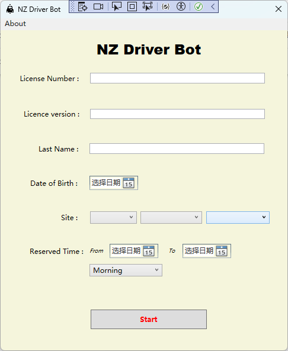

# NZ Driver Bot

I saw there is a web version which will cost 18 NZD per week, that's why I made this.
This is a bot designed to automate the process of booking practical driver license tests in New Zealand. The bot is built using C# WFP and utilizes Selenium for web automation.

## Features

- **Automated Booking**: The bot automates the process of booking practical driver license tests by interacting with the New Zealand Transport Agency (NZTA) website.
- **Site and Date Selection**: Users can select their preferred testing site and date through a user-friendly interface.
- **Error Handling**: The bot provides error messages for missing or invalid input to ensure a smooth user experience.
- **Headless Browser**: Utilizes headless browsing with Chrome to perform automated tasks in the background.
- **Email Notification**: Email Notification on Successful Operation.

## Dependencies

- Newtonsoft.Json: For handling JSON data.
- OpenQA.Selenium: Selenium WebDriver for web automation.
- WebDriverManager: For managing the WebDriver executable.
- NZDriverBot.Common: Contains common utility classes.
- NZDriverBot.Models: Contains model classes for data representation.

## Usage

1. Clone the repository to your local machine.
2. Build and run the application in a C# environment.
3. Select your preferred testing area, location, and site.
4. Input your license details, name, and date of birth.
5. Choose the date range for testing.
6. Click the "Book Test" button to initiate the automated booking process.

## Installation

1. Clone the repository:
`git clone https://github.com/yourusername/NZDriverBot.git`
2. Open the solution file in Visual Studio 2022.
3. Build the solution to restore dependencies.
4. Run the application.

## NZDriverBot.Installer

The `NZDriverBot.Installer` project is responsible for generating the installer for the NZ Driver Bot application. Follow the steps below to generate the installer:

1. Navigate to the `NZDriverBot.Installer` project within the project.
3. Build the project to generate the installer executable.
4. The installer files will generate in the ./bin folder of `NZDriverBot.Installer` project.

## Contribution

Contributions are welcome! If you find any issues or have suggestions for improvement, please feel free to open an issue or contact me: [yu2@me.com](mailto:yu2@me.com).

## License

This project is licensed under the MIT License - see the [LICENSE](LICENSE) file for details.
